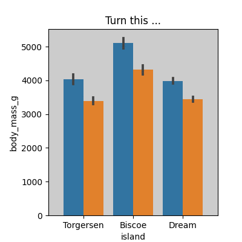
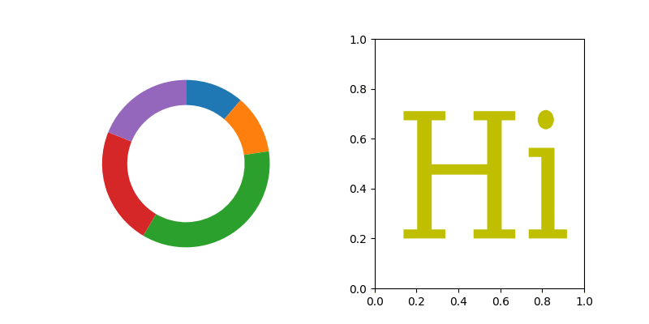

Welcome to mpl_poormans_3d's documentation!
===================================================================

A library to add simple 3d effects to your Matplotlib plot:

It support any bezier curve by linearizing it.

Installation
^^^^^^^^^^^^^

.. code-block:: bash

   pip install https://github.com/leejjoon/mpl-poormans-3d/tree/main

Getting Help
^^^^^^^^^^^^

If you have a question on how to do something with ``mpl_poormans_3d`` a great place
to ask it is: https://discourse.matplotlib.org/c/3rdparty/18.

.. toctree::
   :maxdepth: 3

   examples/index
   API
   Contributing

Indices and tables
==================

* :ref:`genindex`
* :ref:`modindex`
* :ref:`search`
